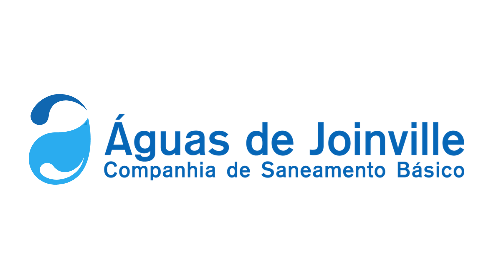

# Webmap – Programa "Águas Para Sempre"

[](https://developer.mozilla.org/docs/Web/HTML)
[](https://developer.mozilla.org/docs/Web/CSS)
[](https://developer.mozilla.org/docs/Web/JavaScript)


---

## Sobre o Projeto
Projeto de Webmap para o programa ambiental **"Águas Para Sempre"**, desenvolvido para a **Companhia Águas de Joinville**, **City of Joinville, Santa Catarina, Brasil (2025)**.  

---

## Tecnologias Utilizadas
- [Leaflet](https://leafletjs.com/)  
- QGIS + [qgis2web plugin](https://plugins.qgis.org/plugins/qgis2web/)  
- HTML5, CSS3, JavaScript  

---

## Visualização
Acesse o Webmap interativo:  
[**Abrir Webmap**](https://caj-ti.github.io/Mapa-Aguas-Para-Sempre/)

---

## Logos e Imagens

<div style="display:flex; align-items:center; justify-content:center; gap:20px;">
  
  
</div>

---

## Como Executar Localmente
1. Clone este repositório:  
   ```bash
   git clone https://caj-ti.github.io/Mapa-Aguas-Para-Sempre

