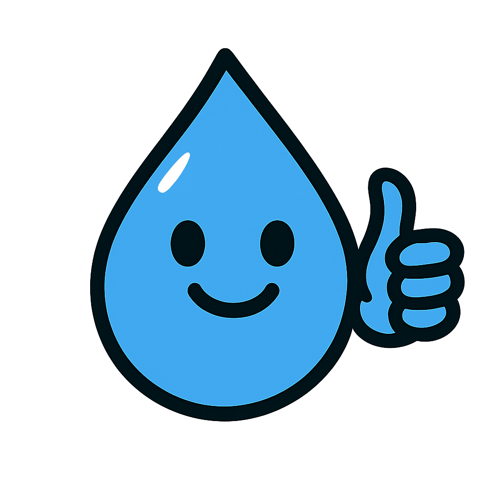

Project of Webmap for the PSA environmental program "Águas Para Sempre", by Companhia Águas de Joinville,City of Joinville, Santa Catarina, Brazil. 2025

          

[Leaflet](https://leafletjs.com/)  QGIS + [qgis2web plugin](https://plugins.qgis.org/plugins/qgis2web/) 

[Access the interactive Webmap](https://kongvinter.github.io/-guasparasempreMAPA/)

